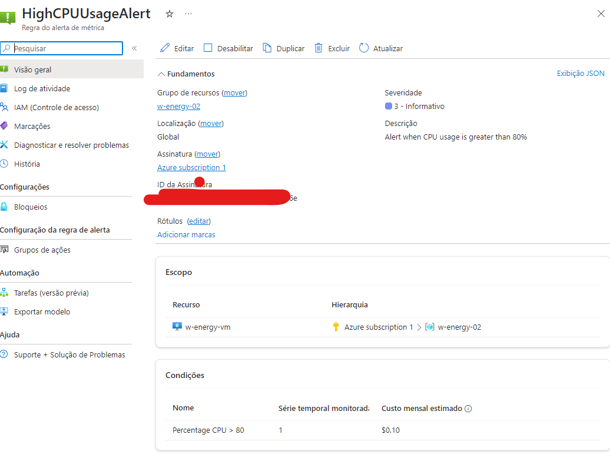
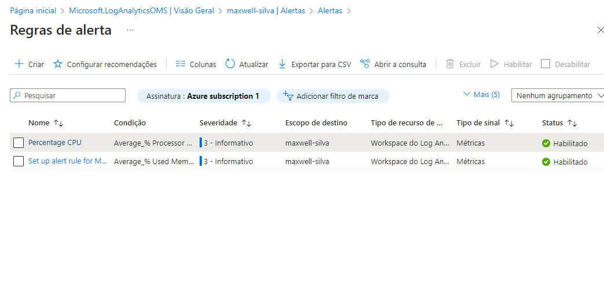

# W-Energy-02

## Prerequisites

- **python3**
- **pip**
- **Linux/Windos+WSL**
- **Azure subscription**
- **Azure credentials** (Client ID, Client Secret, Tenant ID)
- **Deployed VM**

## Setup

1. Install the required packages:

```sh
  ./setup_environment.sh
```

2. Create you env file using [.env.example](./automation/azure/.env.example)

## How To Use

Note: resources from exercise 2 were reused

exec monitoring.py file.

## Customize Metrics

To update limit values is simple, just edit the script e run to apply.

But if you need to implement new metrics. Consult the documentation to know the supported metrics and create a new function to implement them

## Metrics




